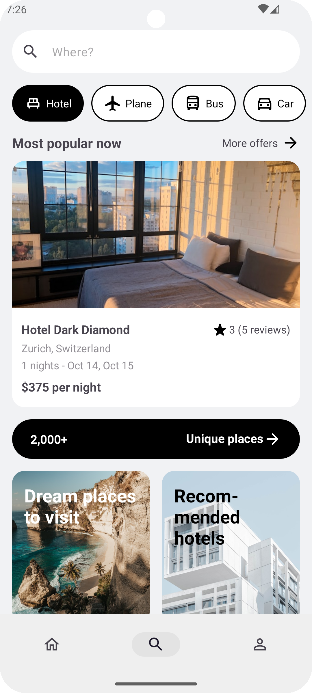
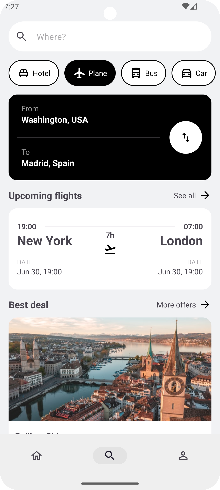
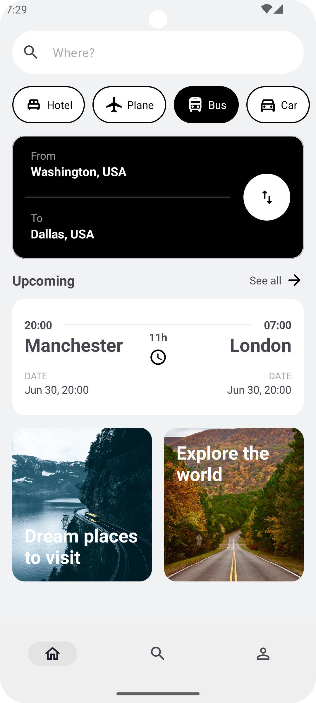

Tripie
==================
## Attention
This application does not have any functionality and only have UI design.

## Screenshots

| :earth_americas:                                                | :rocket:                                                        | :waning_crescent_moon:                                          |
|-----------------------------------------------------------------|-----------------------------------------------------------------|-----------------------------------------------------------------|
|   |   |   |

## Architecture

The **Tripie** app follows the
[official architecture guidance](https://developer.android.com/topic/architecture) from Android.
